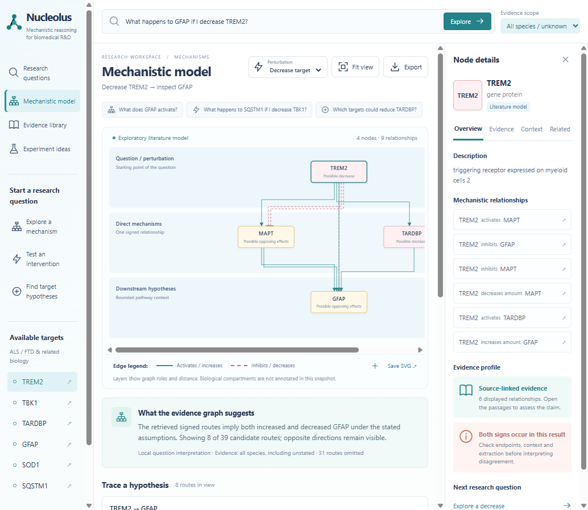
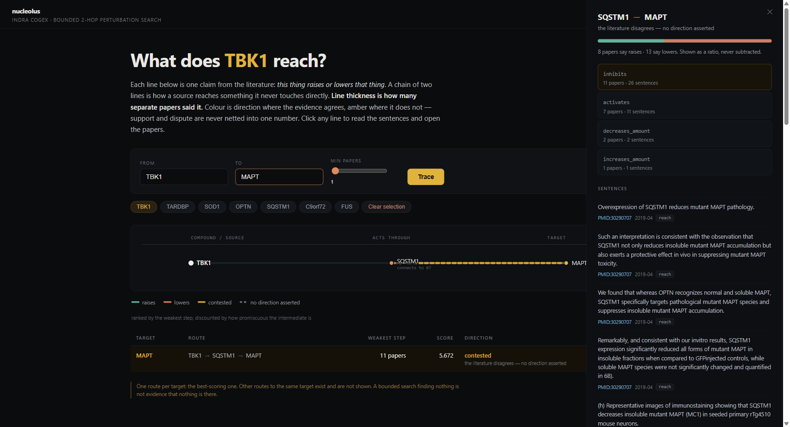
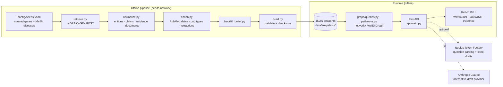

# Nucleolis

**An evidence-first mechanism map for brain-ageing and neurodegeneration research.**
Ask a question in plain language: *"What happens to SQSTM1 if I decrease TBK1?"*. Nucleolis
returns bounded, signed causal routes built from INDRA-extracted literature. Every arrow
opens onto the exact sentences and PubMed papers behind it. Where papers disagree, it shows
both sides instead of averaging them away.

> Built for the **Stockholm AI × Longevity hackathon** (Nebius Token Factory track).
> Repository: [`0xIkra/nucleolus`](https://github.com/0xIkra/nucleolus). The folder is named
> `nucleolus`; the product and Python package are named `nucleolis`.



| | |
|---|---|
| **Video (2–3 min)** | `TODO: add recorded fallback link` |
| **Live demo** | Runs locally and offline. See [Working demo](#5-working-demo) |
| **Status** | Working vertical slice on real data. **No claim has been reviewed by a domain scientist.** |

---

## Contents

1. [Problem and intended user](#1-problem-and-intended-user)
2. [What we built and why](#2-what-we-built-and-why)
3. [Technical architecture and tools](#3-technical-architecture-and-tools)
4. [Data sources, licences and supporting evidence](#4-data-sources-licences-and-supporting-evidence)
5. [Working demo](#5-working-demo)
6. [Results and success metrics](#6-results-and-success-metrics)
7. [Limitations, risks and safety](#7-limitations-risks-and-safety)
8. [Team and next steps](#8-team-and-next-steps)

---

## 1. Problem and intended user

**The user.** A neurodegeneration or brain-ageing researcher (PI, postdoc or translational
scientist) who has to decide *which mechanism to test next*. They know the biology. What they
lack is time to read the hundreds of papers behind each candidate link between genes such as
TBK1, SQSTM1, SIRT1 or NLRP3.

**The problem.** Literature-derived knowledge graphs are the natural tool for this question,
and they fail the user in three specific ways:

1. **Arrows without evidence.** A graph shows "A inhibits B" but not the sentence that says
   so, so the researcher cannot tell a real finding from a text-mining error.
2. **Contradictions get merged.** When 13 papers say a link lowers something and 8 say it
   raises it, most tools net the two into one arrow or pick the majority. That hides the most
   decision-relevant fact: the field disagrees.
3. **False confidence.** Multi-hop "predictions" built by multiplying uncertain extractions
   look precise and mean little. Hub genes such as TNF and TP53 connect everything, so
   routes through them look well supported without discriminating anything.

We measured how serious this is on our own data (see [§6](#6-results-and-success-metrics)).
Half of all signed gene pairs in the literature graph are asserted in both directions, and
most of those contradictions are extraction faults rather than biology.

## 2. What we built and why

Nucleolis is an **evidence map, not a predictor.** It answers *"what mechanisms are claimed,
how well supported are they, and where does the literature contradict itself?"* It does not
answer *"what will happen if I do X?"*.

### Capabilities

| View | What it does |
|---|---|
| **Research workspace** (default, `/`) | Plain-language questions: downstream/upstream activity, bounded mechanism, pair hypothesis, perturbation, knockout, upstream intervention ideas, species filter. Returns signed routes in lanes by graph distance. Common wording parses locally with no API key. |
| **Evidence panel** | Click any connection to see the verbatim sentences, PubMed links, publication date and precision, extracting reader, species (if stated), retraction status and source class. |
| **Pathways** (`/#explorer`) | *From X to Y* or *from X to everything*: a deterministic SOURCE → ACTS THROUGH → TARGET flow with one row per target, ranked by the weakest supporting step. |
| **Resilience vs damage** (`/#resilience`) | Projects the graph through curated ageing axes (autophagy, mitochondrial, plasticity, nutrient sensing vs senescence, neuroinflammation, neuroimmune, oxidative stress, proteostasis) and shows the signed claims that cross between the two sides. |
| **Experiment ideas** (`/#intervention`) | Optional **cited research draft** for a selected route. Every citation is validated against claim IDs in the snapshot, and an invalid citation cannot be shown as a validated draft. |
| **Export** | JSON of the claims, evidence and query manifest in view; SVG of the canvas. |



### Design decisions and why we made them

The tests fail if any of these rules is broken.

- **Opposing claims are never merged.** `A activates B` and `A inhibits B` stay as parallel
  edges with their own counts (`8↑ / 13↓`). A contested link asserts no direction.
- **Signed inference stops at 2 hops.** INDRA belief scores run from about 0.37 to 0.66;
  compounded over three steps they carry no meaning. Beyond two hops the tool reports
  reachability only.
- **Routes are ranked by their weakest step, discounted by hub degree** (`1/log10(degree)`).
  A hub is a good destination and a poor intermediate. This change alone replaced a 4-hop
  hub detour with the real `TBK1 → OPTN → SQSTM1` autophagy axis as the top answer.
- **Modifications are mechanisms, not directions.** Phosphorylation and binding get no sign
  and cannot drive a signed route. A negated claim stays negated; a sign is never flipped.
- **Papers, primary studies and sentences are counted separately.** One paper repeating a
  claim 19 times counts as one paper.
- **Absence is never evidence of absence.** Truncated searches report truncation, and an
  empty result returns `insufficient_evidence`, never "no mechanism exists".
- **Retracted support is shown, not deleted.** Dates are never guessed; they keep PubMed's
  stated precision (day / month / year / unknown).
- **The LLM never writes an uncited answer.** It turns wording into a typed query, and it
  drafts text around claims the graph already holds.
- **Offline by default.** The demo serves from a local, checksum-validated JSON snapshot and
  makes no network request. Fonts are bundled rather than loaded from Google Fonts for the
  same reason.

## 3. Technical architecture and tools



**One offline writer, read-only API.** The pipeline builds and validates an immutable,
content-hashed snapshot. The API only reads it, and a snapshot that fails validation is never
served. There is no database. `graph/pathways.py` and `api/main.py` contain no INDRA-specific
code; only `retrieve.py`, `normalize.py` and `config/predicates.yaml` depend on the source,
so the front of the pipeline can be swapped.

### Tools

| Layer | Tools |
|---|---|
| Backend | Python 3.12+ (developed on 3.14), `uv`, FastAPI, Uvicorn, Pydantic 2, networkx, httpx, PyYAML |
| Frontend | React 19, TypeScript 6, Vite 8, `@xyflow/react` 12 (2D graph), `react-force-graph-3d` + three.js (3D view), IBM Plex via `@fontsource` |
| LLM: question parsing | **Nebius Token Factory**, `openai/gpt-oss-120b` through the OpenAI-compatible API, strict JSON-schema output, one repair attempt, 20 s cap |
| LLM: cited drafts | **Nebius Token Factory** by default (`NEBIUS_MODEL`, or a separate `NEBIUS_SYNTHESIS_MODEL`). Anthropic Claude is opt-in with `LLM_SYNTHESIS_PROVIDER=anthropic`. Citations are validated server-side either way. |
| LLM: offline evaluation | `claude-sonnet-5` machine-labelled the contested-pair evaluation sheet |
| Optional interop | PyBEL / INDRA export (`pip install -e ".[bel]"`) |
| Testing | pytest (242 tests, no network), headless-Chrome UI smoke check (`scripts/verify_research_ui.py`) |

### Layout

```
config/            seeds.yaml (curated genes + rationale) · predicates.yaml · sources.yaml (licences, rate limits)
src/nucleolis/
  pipeline/        retrieve → normalize → enrich → backfill_belief → build; extract.py (LLM extraction pilot)
  graph/           queries.py (bounded neighbourhoods, paths) · pathways.py (weakest-step ranking, hub penalty)
  services/        research.py (question grammar + bounded signed routes) · simulate_target.py (draft pipeline)
  api/             main.py · research.py · axes.py · simulation.py
  llm/             nebius.py · claude.py · scientist.py (provider choice) · prompts.py · settings.py
  corroboration/   AMASS second-channel provenance (built, disabled by default)
  eval/            contested-pair sampling and classification
ui/src/            research/ · pathway/ · showcase/ · intervention/ · graph3d/ · brand/
eval/              contested_review.json: the labelled evaluation sheet
docs/              RESEARCH_WORKSPACE.md · INTERVENTION_SETUP.md · screenshots/
tests/             242 offline tests
```

### Main endpoints

| Endpoint | Purpose |
|---|---|
| `POST /api/research` (alias `POST /ask`) | Plain-language research question → typed plan, signed routes, per-claim evidence IDs, truncation flags |
| `GET /api/research/capabilities` | Snapshot counts, entity catalogue, configured parsers |
| `GET /pathways?source_id=` | Layered routes, one row per target |
| `GET /path?source_id=&target_id=` | ≤5 simple paths; signed claims capped at 2 hops |
| `GET /graph?node_id=` | Bounded 1-hop neighbourhood |
| `GET /nodes/search?q=` | Grounded name and alias lookup |
| `GET /edges/{claim_id}/evidence` | Verbatim quotes, PMIDs, dates, species, reader, retraction |
| `GET /node/{node_id}/evidence` | Incident claims by support |
| `GET /axes` | Resilience-vs-damage projection |
| `GET /exports/graph?node_id=` | Claims, evidence and query manifest as JSON |
| `POST /api/simulate-target` | Optional cited research draft |
| `GET /health` | Snapshot ID, checksum, coverage, limitations, capability flags |

Every graph response carries the snapshot ID, the filters applied and explicit truncation
flags.

## 4. Data sources, licences and supporting evidence

| Source | Used for | Access | Licence and terms |
|---|---|---|---|
| [INDRA CoGEx](https://discovery.indra.bio) (`discovery.indra.bio/api`) | Causal statements, evidence sentences, belief scores | Public REST, no key | INDRA software is BSD-2-Clause. **The content aggregates upstream readers and databases with differing terms, so bulk reuse and redistribution rights are unresolved.** |
| [PubMed E-utilities](https://www.ncbi.nlm.nih.gov/books/NBK25497/) (NCBI) | Publication dates and precision, publication types, retraction flags | Public, rate-limited (3 rps anonymous, 10 rps with key) | NCBI usage policies; we store bibliographic metadata only |
| [HGNC](https://www.genenames.org) REST | Verifying every seed gene ID at run time; alias resolution | Public | HGNC data is freely available |
| [MeSH](https://www.nlm.nih.gov/mesh/) (NLM) | Disease descriptors that select gene sets | Public | NLM terms and conditions |
| [AMASS](https://amass.tech) BiomedCore | Second-channel corroboration (optional) | API key | **Adapter disabled by default.** Access verified, reuse terms not. No AMASS response is committed. |
| Nebius Token Factory; Anthropic API (opt-in) | Runtime question parsing and cited drafts only; nothing stored | API keys, server-side only | Provider terms. Keys never reach logs, responses or exports. |

**What is in this repository:** code, configuration, the evaluation sheet
`eval/contested_review.json` (claim IDs and short quotes for 100 contested pairs) and
screenshots. **What is not:** snapshots and raw data (`data/` is gitignored because of the
unresolved INDRA redistribution terms) and `.env`.

**Code licence:** `TODO: choose and add a LICENSE file`. There is none yet.

### Supporting evidence in this repo

- [`KNOWN_LIMITATIONS.md`](KNOWN_LIMITATIONS.md): every limitation measured against the
  snapshot, including a worked example of an INDRA sign error.
- [`eval/contested_review.json`](eval/contested_review.json): the labelled contested-pair
  sheet behind the headline result, bound to the snapshot checksum.
- [`CHANGES.md`](CHANGES.md): pipeline bugs found and fixed with measurements, and the
  brain-ageing scope expansion.
- [`config/seeds.yaml`](config/seeds.yaml): a written rationale for every seed gene.
- [`docs/RESEARCH_WORKSPACE.md`](docs/RESEARCH_WORKSPACE.md): supported questions, graph
  guarantees and the verification procedure.
- [`docs/INTERVENTION_SETUP.md`](docs/INTERVENTION_SETUP.md): provider setup, evidence
  policy, review manifests and the synthetic no-key demo.

## 5. Working demo

**Recorded fallback (2–3 min):** `TODO: add video link`

**Suggested demo script:**
1. Ask *"What happens to SQSTM1 if I decrease TBK1?"* in the workspace. Signed routes
   appear, and both directions stay visible.
2. Click a contested link. The evidence panel shows the actual sentences, and one of them
   may contradict the sign it was filed under.
3. Open Pathways, trace `TBK1 → MAPT` and show the "contested, no direction asserted" row
   (8 papers raise, 13 lower).
4. Open Resilience vs damage. With the brain-ageing snapshot built, sirtuin → inflammasome
   claims cross the axes; the default `demo_v4` snapshot lacks those genes and lists them as
   missing seeds.
5. Optional: generate a cited research draft and click through a citation to its passage.

### Run it locally

Prerequisites: Python 3.12+, Node.js with npm, and a built snapshot in `data/snapshots/`.

```powershell
# Windows
python -m venv .venv
./.venv/Scripts/python.exe -m pip install -e ".[dev]"
Push-Location ui; npm.cmd ci; Pop-Location
./scripts/run_research.ps1            # builds the UI, serves UI + API on http://127.0.0.1:8079/
```

```bash
# macOS / Linux
uv venv && uv pip install -e ".[dev]"
(cd ui && npm ci)
scripts/launch.sh                     # http://127.0.0.1:8077/
```

Once the snapshot exists, the app is ready in about a second and makes **no network
request**. `/health` should report `snapshot_ready: true`. For hot-reload development, run
`scripts/run_api.sh` and `scripts/run_ui.sh` (UI on port 5173).

**Building a snapshot** (needs network; `data/` is not committed):

```bash
scripts/rebuild_snapshot.sh demo_v5                      # full sentence trail
EVIDENCE_CAP=10 scripts/rebuild_snapshot.sh demo_v5      # brain-ageing scale: ~355 MB snapshot, ~0.4 GB API memory
```

Set `NCBI_API_KEY` in `.env` before rebuilding at brain-ageing scale; without it the PubMed
enrichment step takes about two hours.

### Configuration

Copy `.env.example` to `.env`. **No key is needed** for the pipeline, graph, pathways,
evidence panel or common questions; CoGEx needs no key.

| Variable | Purpose |
|---|---|
| `NOD_DATA_DIR` | Where raw, normalized and snapshot data live (default `./data`) |
| `COGEX_BASE_URL` | INDRA CoGEx API |
| `NCBI_API_KEY`, `NCBI_EMAIL` | Faster PubMed enrichment |
| `NEBIUS_API_KEY`, `NEBIUS_BASE_URL`, `NEBIUS_MODEL` | Broader question parsing and cited drafts |
| `NEBIUS_SYNTHESIS_MODEL` | Optional separate Nebius model for drafts; defaults to `NEBIUS_MODEL` |
| `LLM_SYNTHESIS_PROVIDER`, `ANTHROPIC_API_KEY`, `ANTHROPIC_MODEL` | Opt-in: set the provider to `anthropic` to draft with Claude |
| `AMASS_API_KEY`, `AMASS_ENABLED` | Optional corroboration; disabled until reuse rights are confirmed |

**Tests:** `./.venv/Scripts/python.exe -m pytest tests -q` (on POSIX use `.venv/bin/python`).

## 6. Results and success metrics

The build figures below come from the snapshot and eval files, not estimates.

### Headline: most literature "contradictions" are extraction faults

In snapshot `demo_v3`, **117 of 232 ordered gene pairs (50%)** with a signed claim are
asserted in *both* directions. We sampled 100 contested pairs, and `claude-sonnet-5` labelled
91 of them after reading both sides' quotes:

| Label | Pairs | Kind |
|---|---:|---|
| Polarity error: sentence contradicts the filed sign | 34 | extraction fault |
| Co-mention: entities appear together, no causal claim | 23 | extraction fault |
| Readout conflation: different readouts merged | 10 | extraction fault |
| Uninterpretable | 9 | extraction fault |
| Direction error: subject and object swapped | 3 | extraction fault |
| **Genuine scientific disagreement** | **8** | scientific |
| **Context difference** (cell type, model, condition) | **4** | scientific |

**79 of 91 (87%) are extraction faults; only 12 (13%) reflect real science.** A team member
spot-checked 7 labels by hand and all 7 agreed. That check is recorded in our build notes,
not in the sheet, which still marks every label `MACHINE`. In two cases the model labelled a
fault as genuine disagreement, so 87% is more likely a floor than a ceiling.

**Scale does not fix this.** At 34× the claim count (11,751 signed relations over 171 genes)
the contested rate was still 50%.

**Confidence scores do not catch it either.** INDRA's belief score has no signal for
correctness here. Median belief is 0.485 for polarity errors and 0.479 for genuine
disagreements. A 0.5 cutoff would discard 6 of 8 genuine disagreements and keep 17 faults.
Nucleolis therefore shows *source class* (curated database vs machine-read text) instead of
ranking by belief.

### Success metrics

| Metric | Target | Result |
|---|---|---|
| Every displayed claim links to a verbatim source sentence | 100% | 6,228 of 6,373 evidence records carry a quote. Claims without a resolvable paper are kept but contribute zero support. |
| Opposing claims never merged | 0 violations | Enforced by tests |
| Offline cold start | Yes, < 5 s | ~1 s, no network |
| Signed inference depth | ≤ 2 hops | Enforced; hop 3+ is unsigned reachability only |
| Publication dates without guessing | Max coverage, precision kept | 2,875 of 2,916 dated (1,304 day, 1,062 month, 509 year, 41 unknown) |
| Retractions surfaced | All | 4 retracted papers found; 2 claims whose *only* support is retracted are flagged, not deleted |
| Ranking discriminates rather than rewards hubs | Top answer changes | The hub penalty surfaced `TBK1 → OPTN → SQSTM1` in place of a 4-hop hub detour |
| Test suite, no network | Passes | **242 passed** (3.6 s) |

### Engineering results

- **Retrieval went from ~7.5 min to 7.2 s.** A batch evidence endpoint existed in the code
  but was never called, and 23% of per-hash calls were duplicates.
- **Found an undocumented CoGEx limit.** `indra_subnetwork_meta` rejects 400 or more nodes,
  and naive chunking silently drops cross-chunk edges. We query all chunk *pairs* instead.
- **Scope grew from ALS/FTD to brain ageing:** 32 → ~870 entities, 669 → 61,294 claims,
  2,916 → 279,913 papers, 6,373 → 678,363 evidence records. Evidence capping keeps paper
  counts exact while cutting the snapshot from ~900 MB to 355 MB.

### Snapshots

| Snapshot | Entities | Claims (signed) | Papers | Evidence | Notes |
|---|---:|---:|---:|---:|---|
| `demo_v4` (demo default) | 32 | 669 (495) | 2,916 | 6,373 | Dated, belief on 669/669 (0.366–0.924, median 0.468) |
| Brain-ageing | ~870 | 61,294 | 279,913 | 678,363 | 116 negated evidence records; **dates not yet enriched** |

## 7. Limitations, risks and safety

Full detail, with numbers, is in [`KNOWN_LIMITATIONS.md`](KNOWN_LIMITATIONS.md).

**Scientific limitations**

- **Nothing is reviewed.** Every claim comes from automated readers (mostly REACH) and
  curated databases, and `review_status` is `unreviewed` on all evidence.
- **Signs can be wrong.** For example, `ATXN2 inhibits TARDBP` is supported by a sentence
  saying ATXN2 *depletion decreases* TARDBP, which implies the opposite sign.
- **Context is mostly missing.** Only 13% of evidence carries structured context (species,
  cell type, tissue), and cell type is almost never present. Species is displayed but cannot
  safely be used as a hard filter.
- **Support counts are papers, not independent studies.** Replications from one lab and
  shared cohorts are not detected.
- **Two-step composition assumes compatible states and contexts** that nobody has
  established. Node colours show route-implied possibilities, not measured states.
- **Coverage is bounded and curated.** Seeds are hand-picked with written rationale; genes
  absent from CoGEx (NFE2L2 and KL in one run) are reported, not hidden.

**What it does not do, and must not be used for:** clinical decisions, treatment or dosing
advice, drug selection, efficacy or safety prediction, target validation, or claims of novel
discovery. A "knockout" question gives a directional literature hypothesis, not the real
consequence of a knockout. Gene targets are not drug candidates.

**Safety and responsible-use measures built in**

- Every answer is graph-derived and cites claim IDs. LLM output with invalid citations is
  rejected, and provider failures fall back to the deterministic analysis with an explicit
  error.
- Draft prose is checked for citation IDs, not for entity names. A live test caught a draft
  naming the wrong gene for a valid HGNC ID. Gene names are now sent to the model with every
  link, but no automatic name check exists yet, so read each draft against its cited claims.
- The LLM parser is constrained to a strict JSON schema, and entity slots may only contain
  mentions from the question. It cannot introduce entities.
- Missing keys degrade to evidence browsing, never to fabricated output.
- Contradictions, truncation, retractions and unknown dates are shown, never smoothed over.
- API keys stay server-side and are excluded from logs, responses and exports.

**Operational risks**

- **Licensing:** INDRA content redistribution rights and AMASS reuse terms are unresolved.
  Do not host publicly or use commercially until they are settled.
- The brain-ageing snapshot has no publication dates yet because of PubMed rate limits.
- `coverage.evidence_with_quote` is computed before the evidence cap and can exceed the
  post-cap total.
- API keys have passed through development transcripts; rotate them before any public
  deployment.

## 8. Team and next steps

### Team

| Name | Role |
|---|---|
| `TODO` Ikramur Rahman ([@0xIkra](https://github.com/0xIkra)) | `TODO: role` |
| `TODO` (GitHub: mangofillet) | `TODO: role` |
| `TODO` | `TODO` |

### Next steps

Ordered by expected gain in accuracy per unit of effort. The priority is new *kinds* of
signal, not more volume, because our own data show volume leaves the contested rate at 50%.

1. **Human review of the contested sheet.** Record the hand labels in
   `eval/contested_review.json` and turn the 7-item spot check into a proper precision
   estimate.
2. **Extraction-fault filter.** Use the four-slot extractor pilot
   (`intervention, stimulus, readout, direction`; 28 claims from 25 papers in 31 s) to
   separate stimulus from readout. That targets polarity errors and readout conflation,
   which together make up 48% of contested pairs. Grounding in the pilot resolved only 2 of
   28 mentions at last check, so fix that first.
3. **"Surprise" ranking axis.** 62 low-support, non-hub claims (13% of signed claims)
   currently rank at a median of 323 of 495, and none reach the top 24. Show a surprise
   rank next to the support rank, always with the quote beside it.
4. **Context enrichment from MeSH.** PubMed EFetch recovers species *and* microglia/astrocyte
   tags for free, which makes species and cell type usable as filters.
5. **Date the brain-ageing snapshot** using an NCBI API key.
6. **Convergence view:** many upstream sources converging on one readout, for
   multifactor processes.
7. **Curated second sources.** SIGNOR (CC BY 4.0) and OmniPath adapters give claims an
   independent, non-text-mined channel.
8. **Settle licensing** for INDRA content and AMASS, then add a LICENSE file and consider
   public hosting.

---

*Nucleolis surfaces what the literature claims and how well each claim is supported. It
does not decide what is true.*
